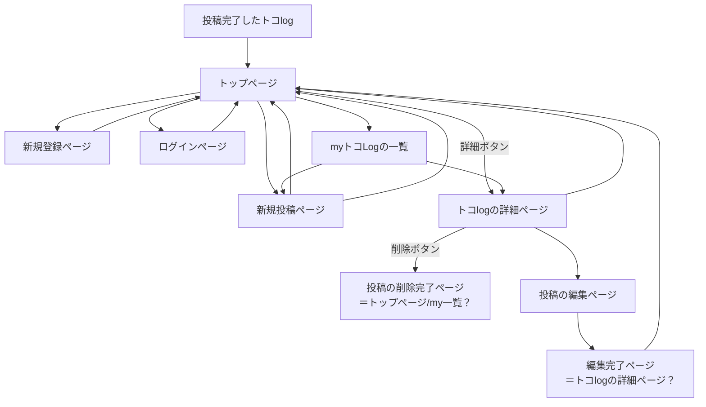

## アプリケーション名
TokoTokoLog(トコトコLog)

## 一言で言うとどんなアプリか
散歩体験を地図と共に記録し、共有するアプリです。

## どんな機能があるのか（予定）
- ユーザー登録/ログイン
- 地図上の任意の場所にピン刺しが可能で、ピンに複数の画像またはコメントを紐づけることができる（散策を投稿する機能）
- （Better機能）地図上のピンをクリックすると、同じ画面で画像等を表示できる
- 投稿(散策)を一覧表示できる

## 誰のどんな問題を解決するのか
- 山岳や観光地以外の旅先で、短時間で周れる散策についての情報が無いこと
- SNS等で散策画像を見ても地図上の場所が不明なため、自分が旅するイメージが沸かないこと
- 自分の守備範囲外であった散策の楽しみ方に出会うきっかけが無いこと

## アプリを作成する背景
街の見晴らしスポット巡りが趣味ですが、仕事柄まとまった休日が取れず、
限られた時間での散策ルートを計画することが困難でした。
見晴らしスポット情報が集まる投稿サイトは有っても、
複数のスポットを実際に巡り歩いたという情報がなく、
私にとっては不十分と感じた事がきかっけです。

## データベース設計

### users テーブル

| Column             | Type   | Options     |
| ------------------ | ------ | ----------- |
| id(PK)             | integer | null: false               |
| email              | string | null: false, unique: true |
| encrypted_password | string | null: false |
| name               | string | null: false |

### Association

- has_many :toko_logs

### toko_logs テーブル

| Column             | Type       | Options     |
| ------------------ | ------     | ----------- |
| id(PK)             | integer    | null: false               |
| title              | string     | null: false |
| description        | text       | null: false |
| user               | references | null: false, foreign_key: true |

### Association

- belongs_to :user
- has_many :pins

### pins テーブル

| Column             | Type       | Options     |
| ------------------ | ------     | ----------- |
| id(PK)             | integer    | null: false               |
| order_of_pins      | integer    | null: false               |
| latitude           | integer    | null: false               |
| longitude          | integer    | null: false               |
| comment            | text       |                           |
| toko_log           | references | null: false, foreign_key: true |

### Association

- belongs_to :toko_log

<!-- 一つのピンに複数の画像を登録する機能は、ActiveStorageで実装する -->

## 画面遷移図
